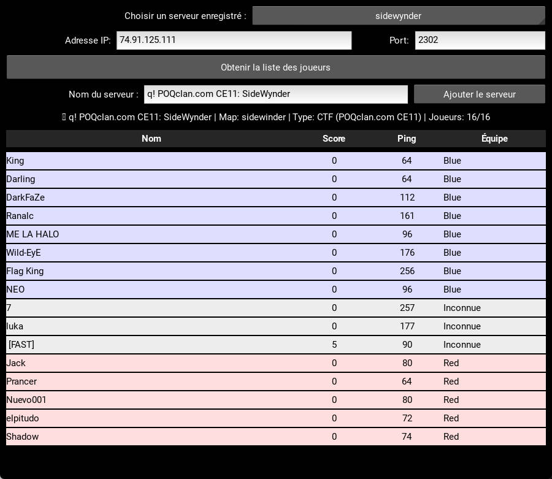

# HaloCEUserList
Python script with tk UI to list users on Halo CE servers whose IP and ports are saved in a list.

You can run it from a laptop:
`python main.py`

Or from an Android phone, check the releases for the APK.

Users are displayed with the team they belong to but due to a server side bug, when game is full or almost full, some players teams are not returned:

